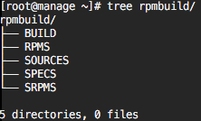

###创建Rpm包

#####Linux CentOS

1. 下载相关软件包

	`yum install rpm-build rpmdevtools`
	
2. 初始目录 

	`rpmdev-setuptree`  默认目录*~/rpmbuild*
	
	
	
	目录|代码|名称|用途
	----|----|----|---- 
	BUILD|%_builddir|构建目录|源代码包解压至此，并编译
	RPMS|%_rpmdir|标准RPM包目录|生成/保存二进制RPM包
	SOURCES|%_sourcedir|源代码目录|保存源码包(.tar)和所有patch补丁
	SPECS|%_specdir|Spec文件目录|保存RPM包配置文件(.spec)
	SRPMS|%_srcrpmdir|源代码RPM包目录|生成/保存源码RPM包(SRPM)
	BUILDROOT|%_buidrootdir|最终安装目录|保存%install阶段安装文件
	
	阶段|读取|写入|具体
	---|---|---|---
	%prep|%_sourcedir|%_builddir|读取源代码和patch，解压
	%build|%_buiddir|%_builddir|编译(./configure && make)
	%install|%_buiddir|%_buildrootdir|读取安装，这些文件就是用户安装RPM后得到的文件(make install)
	%check|%_builddir|%_builddir|检查软件是否正常运行(make test)很多不需要
	bin|%_buildrootdir|%_rpmdir|创建rpm包
	src|%_sourcedir|%_srcrpmdir|创建源码rpm包